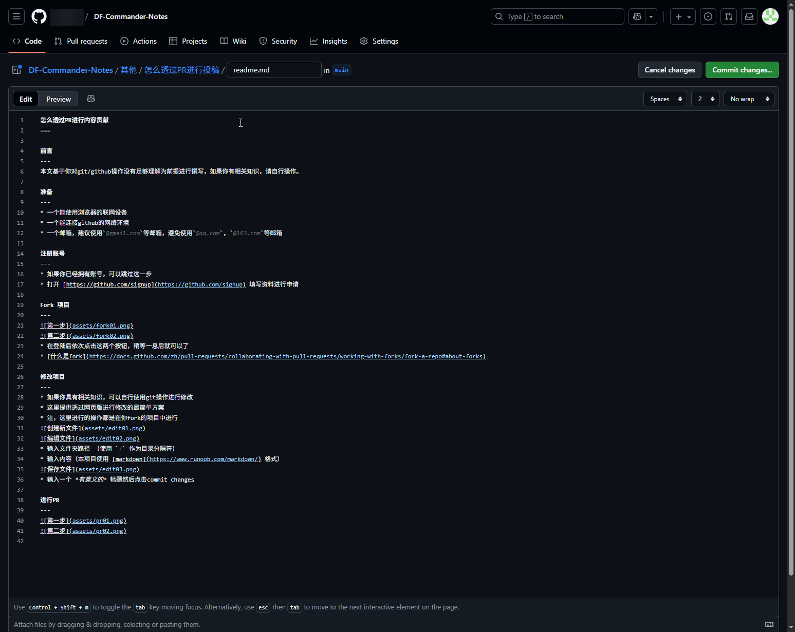

怎么透过PR进行内容贡献
===

前言
---
本文基于你对git/github操作没有足够理解为前提进行撰写，如果你有相关知识，请自行操作。

准备
---
* 一个能使用浏览器的联网设备
* 一个能连接github的网络环境
* 一个邮箱，建议使用`@gmail.com`等邮箱，避免使用`@qq.com`, `@163.com`等邮箱

注册账号
---
* 如果你已经拥有账号，可以跳过这一步
* 打开 [https://github.com/signup](https://github.com/signup) 填写资料进行申请

Fork 项目
---
  
  
* 在登陆后依次点击这两个按钮，稍等一息后就可以了
* [什么是fork](https://docs.github.com/zh/pull-requests/collaborating-with-pull-requests/working-with-forks/fork-a-repo#about-forks)

修改项目
---
* 如果你具有相关知识，可以自行使用git操作进行修改
* 这里提供透过网页版进行修改的最简单方案
* 注，这里进行的操作都是在你fork的项目中进行  
### 创建文件

* 输入文件夹路径 （使用 `/` 作为目录分隔符）
* 输入内容（本项目使用 [markdown](https://www.runoob.com/markdown/) 格式）  

* 输入一个 *有意义的* 标题然后点击commit changes
### 修改文件

* 后续操作与创建文件一样
### 上传文件
* 在本机透过编辑器如[vscode](https://code.visualstudio.com/)编写完成后，可以将文件/文件夹上传

* 选择本地文件夹、文件上传

进行PR
---
  

