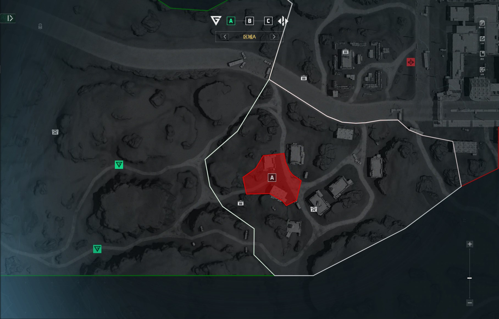
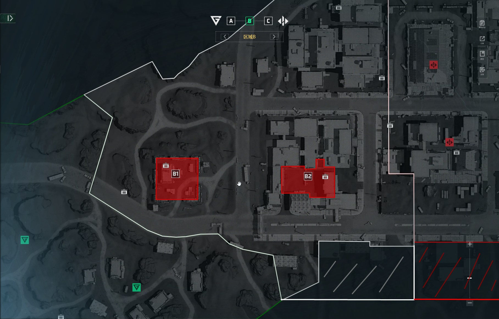
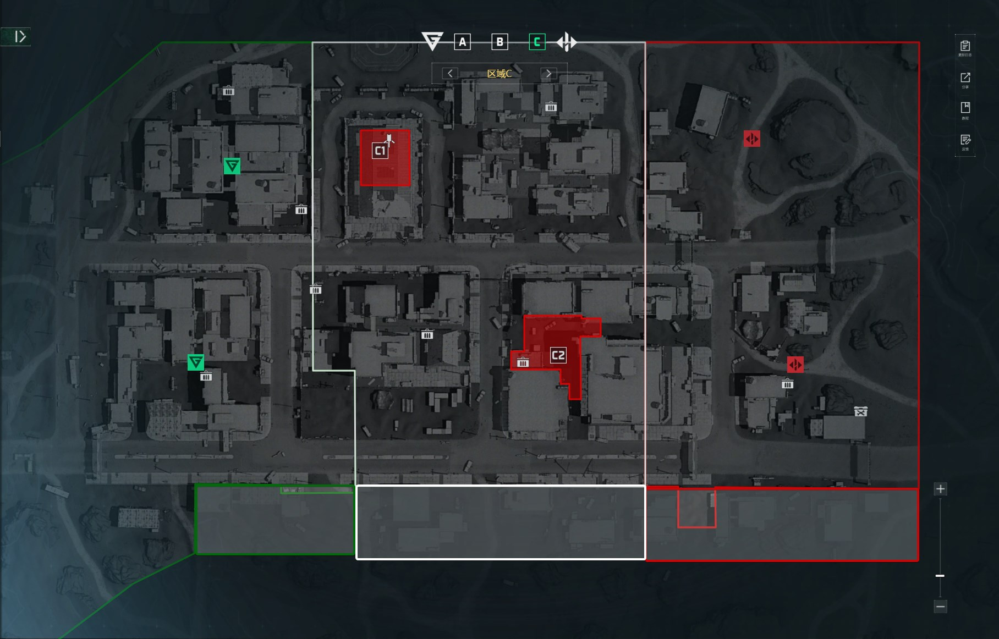

烬区
===
注：本文档为客观描述文档，用于描述“无需复述”的内容 

A点
---
  
* 进攻方载具 
  * 人口低于 (待填充) 时，刷新一辆白板冲锋车
  * 人口低于 (待填充) 时，刷新一辆白板坦克
* 防守方载具
  * 无

B点
---
  
* 注：官方地图工具为旧版本，新版地图参考手动补充部分  
* 进攻方载具 
  * 主坦 * 1 场上限 - CD -s
* 防守方载具
  * 轻坦 * 1 场上限 - CD -s

C点
---

* 注：官方地图工具为旧版本，新版地图参考手动补充部分 
* 进攻方载具 
  * 无
* 防守方载具
  * 无 
