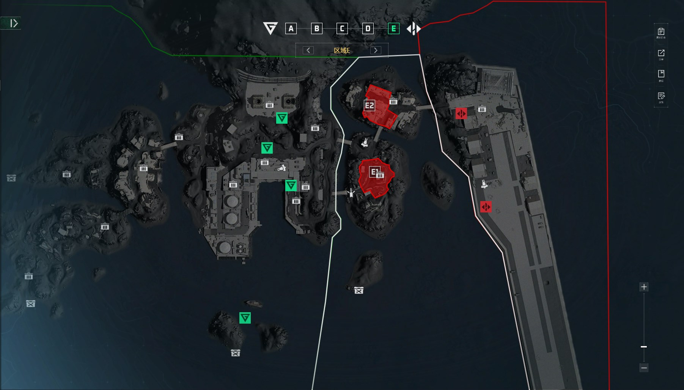

风暴眼
===
注：本文档为客观描述文档，用于描述“无需复述”的内容 

A点
---

* 进攻方载具 
  * 摩托艇 * (待填充) 场上限 (待填充) CD (待填充)s
  * 小鸟 * (待填充) 场上限 (待填充) CD (待填充)s
  * 攻击艇 * (待填充) 场上限 (待填充) CD (待填充)s
  * 人口低于 (待填充) 时，刷新一辆白板冲锋车
  * 人口低于 (待填充) 时，刷新一辆白板轮突
* 防守方载具
  * 摩托艇 * (待填充) 场上限 (待填充) CD (待填充)s
  * 攻击艇 * (待填充) 场上限 (待填充) CD (待填充)s
  * 防空车 * (待填充) 场上限 (待填充) CD (待填充)s

B点
---

* 进攻方载具 
* 防守方载具

C点
---

* 进攻方载具 
* 防守方载具

D点
---

* 进攻方载具 
* 防守方载具

E点
---

* 进攻方载具 
* 防守方载具